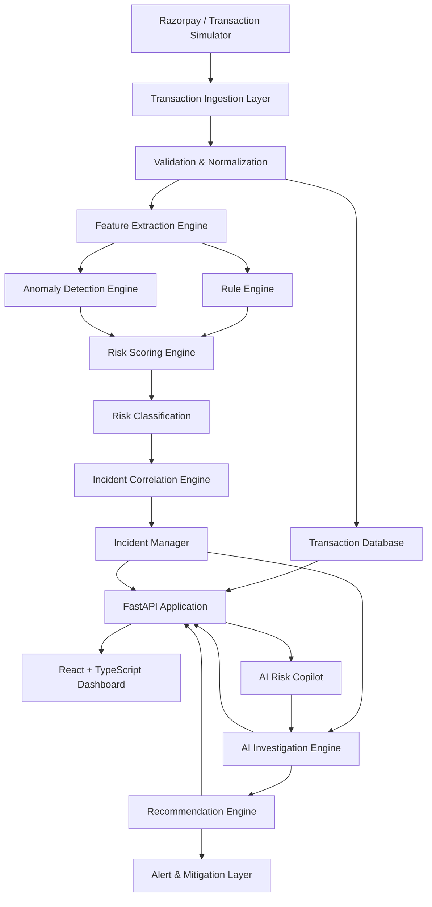
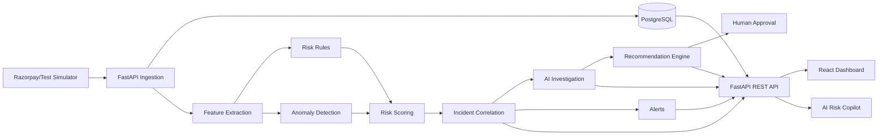

# PayGuard AI — System Architecture

## 1. Document Purpose

This document defines the high-level technical architecture of **PayGuard AI**, an AI-powered risk management platform for digital payments.

PayGuard AI is designed to:

* Monitor payment transactions
* Detect suspicious or abnormal activity
* Calculate transaction and incident risk
* Correlate related anomalies
* Investigate incidents using AI
* Explain why risk was detected
* Estimate financial exposure
* Recommend mitigation actions
* Maintain human approval for sensitive actions
* Provide an interactive AI Risk Copilot

This architecture is designed specifically for a hackathon MVP while remaining modular enough to evolve into a production-scale platform.

---

# 2. Architecture Philosophy

PayGuard AI will follow these architectural principles:

### 2.1 Modular Monolith First

The backend will initially be implemented as a **modular monolith** using FastAPI.

We will NOT start with microservices.

Reason:

* Faster development
* Easier debugging
* Easier deployment
* Lower infrastructure complexity
* Better suited for an individual hackathon project
* Modules can later be separated into services if scale requires it

---

### 2.2 AI Is Not the Source of Truth

The LLM/AI layer must not independently decide whether a transaction is fraudulent.

The source of truth comes from:

* Transaction data
* Risk rules
* Statistical signals
* Anomaly detection
* Historical patterns
* Risk scores
* Incident evidence

AI uses this evidence to:

* Investigate
* Summarize
* Explain
* Recommend

---

### 2.3 Human-in-the-Loop for Sensitive Actions

PayGuard AI may automatically:

* Detect risk
* Create incidents
* Generate alerts
* Perform investigations
* Recommend mitigations

PayGuard AI must NOT automatically perform destructive financial actions such as:

* Blocking customers
* Freezing merchants
* Cancelling payments
* Restricting accounts
* Disabling payment methods

without explicit authorization.

---

# 3. High-Level System Architecture



---

# 4. Core Technology Stack

## 4.1 Frontend

```text
React
TypeScript
Vite
Tailwind CSS
React Router
TanStack Query
Recharts
Lucide Icons
```

### Responsibilities

The frontend will provide:

* Risk dashboard
* Transaction explorer
* Incident management
* Risk analytics
* Alert center
* AI investigation view
* AI Copilot
* Settings
* Approval interface for mitigation actions

---

# 4.2 Backend

```text
Python
FastAPI
Pydantic
SQLAlchemy
Alembic
Uvicorn
```

### Responsibilities

The backend will handle:

* REST APIs
* Transaction ingestion
* Razorpay webhook processing
* Authentication
* Risk calculations
* Incident management
* AI orchestration
* Database operations
* Alerts
* Recommendations
* Audit logging

---

# 4.3 Database

Primary database:

```text
PostgreSQL
```

ORM:

```text
SQLAlchemy
```

Database migrations:

```text
Alembic
```

PostgreSQL will store:

* Users
* Merchants
* Customers
* Transactions
* Risk scores
* Risk factors
* Incidents
* Alerts
* Investigations
* Recommendations
* Approvals
* Audit logs

---

# 4.4 AI Layer

The AI layer will be isolated from the deterministic payment-processing logic.

It will be responsible for:

* Incident investigation
* Evidence summarization
* Root-cause explanation
* Risk explanations
* Recommendation generation
* Conversational risk analysis
* Incident report generation

The exact AI provider will remain configurable through environment variables.

Example:

```text
AI_PROVIDER=
AI_API_KEY=
AI_MODEL=
```

This prevents the application from being tightly coupled to one provider.

---

# 4.5 Razorpay Integration

Razorpay integration will support:

```text
Razorpay Test Mode
Webhooks
Payment Events
Payment Metadata
Order Information
Payment Status
Failure Information
```

During development we will also create a:

```text
Transaction Simulator
```

This ensures the entire PayGuard system can be demonstrated even when external APIs are unavailable.

---

# 5. Primary Application Flow

The core transaction-processing pipeline is:

```text
Incoming Transaction
        ↓
Validate Transaction
        ↓
Normalize Data
        ↓
Persist Transaction
        ↓
Extract Risk Features
        ↓
Apply Risk Rules
        ↓
Run Anomaly Detection
        ↓
Calculate Risk Score
        ↓
Generate Risk Factors
        ↓
Classify Risk
        ↓
Correlate With Existing Incidents
        ↓
Create / Update Incident
        ↓
Run AI Investigation
        ↓
Calculate Revenue at Risk
        ↓
Generate Recommendation
        ↓
Create Alert
        ↓
Display on Dashboard
```

---

# 6. Transaction Sources

PayGuard AI should support multiple sources.

## Source 1 — Transaction Simulator

Used during development and hackathon demonstration.

Example generated transactions:

```json
{
  "payment_id": "pay_demo_001",
  "merchant_id": "merchant_001",
  "customer_id": "customer_101",
  "amount": 4500,
  "currency": "INR",
  "method": "upi",
  "bank": "ABC Bank",
  "status": "failed",
  "failure_code": "payment_failed"
}
```

---

## Source 2 — Razorpay Test Environment

Transactions can be ingested from Razorpay test-mode APIs and webhook events.

---

## Source 3 — Manual API

Development endpoint:

```text
POST /api/v1/transactions
```

This allows controlled testing of individual transaction scenarios.

---

# 7. Transaction Ingestion Layer

Location:

```text
backend/app/modules/transactions/
```

Responsibilities:

* Receive transaction
* Validate schema
* Normalize payment data
* Detect duplicates
* Generate internal IDs
* Store original source
* Store transaction
* Trigger risk pipeline

---

# 8. Webhook Processing Architecture

Razorpay events will enter through:

```text
POST /api/v1/webhooks/razorpay
```

Processing flow:

```text
Razorpay
    ↓
Webhook Endpoint
    ↓
Signature Verification
    ↓
Event Validation
    ↓
Idempotency Check
    ↓
Event Normalization
    ↓
Transaction Persistence
    ↓
Risk Pipeline
```

Webhook processing must prevent duplicate event processing.

Each webhook event should store:

```text
event_id
event_type
source
received_at
processing_status
payload_hash
```

---

# 9. Feature Extraction Engine

Location:

```text
backend/app/modules/risk/features/
```

Feature extraction converts raw transaction information into useful risk signals.

Examples:

```text
transaction_amount
customer_average_amount
amount_deviation
transactions_last_1_minute
transactions_last_10_minutes
failed_attempts
device_transaction_count
new_device
new_location
payment_method_failure_rate
merchant_failure_rate
bank_failure_rate
customer_risk_history
```

Example:

```text
Transaction Amount:
₹50,000

Customer Historical Average:
₹4,200

Amount Deviation:
11.9x
```

This becomes an input to the risk engine.

---

# 10. Risk Rule Engine

Location:

```text
backend/app/modules/risk/rules/
```

The rule engine contains deterministic rules.

Example:

```text
RULE_HIGH_AMOUNT
```

Condition:

```text
amount > historical_average × threshold
```

Result:

```text
+20 risk points
```

Another example:

```text
RULE_HIGH_VELOCITY
```

Condition:

```text
5+ transactions within 60 seconds
```

Result:

```text
+25 risk points
```

Rules must generate:

```text
rule_id
rule_name
score
reason
evidence
```

---

# 11. Anomaly Detection Engine

Location:

```text
backend/app/modules/risk/anomaly/
```

The anomaly engine detects patterns that cannot be captured easily using fixed rules.

Initial MVP techniques may include:

```text
Rolling averages
Z-score detection
Moving failure rates
Historical deviation
Velocity analysis
Threshold deviation
Statistical outlier detection
```

Advanced versions may later include machine-learning models.

The first version should prioritize:

```text
Explainability
Reliability
Speed
```

over unnecessary model complexity.

---

# 12. Risk Scoring Engine

Location:

```text
backend/app/modules/risk/scoring/
```

The scoring engine combines:

```text
Rule score
+
Anomaly score
+
Historical signals
+
Contextual signals
```

into:

```text
0–100 Risk Score
```

Classification:

```text
0–29    LOW

30–59   MEDIUM

60–79   HIGH

80–100  CRITICAL
```

Example:

```text
Risk Score: 86

+25 High transaction velocity
+20 Unusual payment amount
+18 New device
+15 Geographic anomaly
+8 Previous failed attempts

Final Risk Level:
CRITICAL
```

Every score must remain explainable.

---

# 13. Incident Correlation Engine

Location:

```text
backend/app/modules/incidents/correlation/
```

The purpose of this engine is to prevent hundreds of related transactions from appearing as separate unrelated alerts.

Example:

300 failed UPI transactions from the same bank should generate:

```text
1 INCIDENT
```

rather than:

```text
300 independent alerts
```

Possible correlation dimensions:

```text
Bank
Payment method
Merchant
Customer
Device
Location
Failure reason
Time window
Risk pattern
```

---

# 14. Incident Manager

Location:

```text
backend/app/modules/incidents/
```

Incident lifecycle:

```text
DETECTED
    ↓
INVESTIGATING
    ↓
ACTION_RECOMMENDED
    ↓
MONITORING
    ↓
RESOLVED
```

Alternative state:

```text
ESCALATED
```

Incident severity:

```text
LOW
MEDIUM
HIGH
CRITICAL
```

---

# 15. AI Investigation Engine

Location:

```text
backend/app/modules/ai/investigation/
```

The AI Investigation Engine receives structured evidence.

Example input:

```text
Incident:
UPI failure spike

Current failure rate:
14.2%

Historical baseline:
3.8%

Affected transactions:
342

Primary bank:
ABC Bank

ABC Bank contribution:
81%

Merchant API latency:
Normal

Card success rate:
Normal
```

AI may produce:

```text
Likely Root Cause:

Payment degradation associated with ABC Bank's UPI transactions.

Confidence:
91%

Evidence:

• 81% of failed UPI payments are associated with ABC Bank.
• Merchant API latency remains normal.
• Card payments remain within historical success rates.
```

AI must never invent evidence.

---

# 16. AI Context Builder

Before information is sent to the AI model, a context builder will gather relevant structured information.

```text
Incident
    ↓
Related Transactions
    ↓
Risk Factors
    ↓
Payment Method Metrics
    ↓
Merchant Metrics
    ↓
Historical Baseline
    ↓
Recent Alerts
    ↓
AI Context
```

Location:

```text
backend/app/modules/ai/context/
```

---

# 17. AI Output Validation

AI output should follow a structured schema.

Example:

```json
{
  "summary": "...",
  "likely_root_cause": "...",
  "confidence": 0.91,
  "evidence": [],
  "recommended_actions": [],
  "uncertainties": []
}
```

Pydantic models must validate AI responses before they are stored or displayed.

---

# 18. Recommendation Engine

Location:

```text
backend/app/modules/recommendations/
```

Input:

```text
Incident
Risk Level
Root Cause
Affected Systems
Financial Exposure
```

Output example:

```text
Recommended Action:

Temporarily encourage alternate payment methods.

Reason:

The UPI degradation appears isolated to ABC Bank.

Expected Outcome:

Reduce checkout failures while the affected provider recovers.
```

---

# 19. Mitigation Architecture

Actions are classified as:

## Safe Actions

Can execute without human approval:

```text
Create alert
Create incident
Increase monitoring
Generate recommendation
Send notification
Generate investigation report
```

## Sensitive Actions

Require explicit human approval:

```text
Block customer
Freeze merchant
Disable payment method
Modify payment limits
Restrict account
Change routing
```

Flow:

```text
AI Recommendation
        ↓
Approval Required?
        ↓
YES
        ↓
Pending Approval
        ↓
Human Approves
        ↓
Action Executor
        ↓
Audit Log
```

---

# 20. Revenue-at-Risk Engine

Location:

```text
backend/app/modules/analytics/revenue_risk/
```

The system calculates estimated monetary exposure.

Inputs may include:

```text
Affected transaction amount
Failure probability
Incident duration
Historical success rate
Merchant payment volume
Recovery probability
```

Example:

```text
Affected Payment Value:
₹5.1L

Estimated Recoverable:
₹82K

Revenue Currently at Risk:
₹4.28L
```

---

# 21. AI Risk Copilot Architecture

Users can ask natural-language questions.

Example:

```text
Why are payments failing?
```

Flow:

```text
User Question
      ↓
Copilot API
      ↓
Intent Detection
      ↓
Retrieve Relevant System Data
      ↓
Build Structured Context
      ↓
AI Model
      ↓
Validate Response
      ↓
Return Answer
```

The Copilot must query real PayGuard data before answering operational questions.

---

# 22. Backend Architecture

Backend directory:

```text
backend/
│
├── app/
│   │
│   ├── main.py
│   │
│   ├── config.py
│   │
│   ├── database.py
│   │
│   ├── dependencies.py
│   │
│   ├── constants.py
│   │
│   ├── exceptions.py
│   │
│   ├── logging_config.py
│   │
│   ├── security.py
│   │
│   ├── middleware.py
│   │
│   ├── enums.py
│   │
│   ├── utils/
│   │
│   ├── core/
│   │
│   └── modules/
│   │       │
│   │       ├── auth/
│   │       ├── users/
│   │       ├── merchants/
│   │       ├── customers/
│   │       ├── transactions/
│   │       ├── webhooks/
│   │       ├── risk/
│   │       │   ├── features/
│   │       │   ├── rules/
│   │       │   ├── anomaly/
│   │       │   └── scoring/
│   │       │
│   │       ├── incidents/
│   │       │   └── correlation/
│   │       │
│   │       ├── investigations/
│   │       ├── recommendations/
│   │       ├── alerts/
│   │       ├── analytics/
│   │       ├── copilot/
│   │       ├── approvals/
│   │       └── audit/
│   │
│   └── tests/
│
├── alembic/
├── requirements.txt
├── alembic.ini
├── .env.example
└── README.md
```

---

# 23. Standard Backend Module Structure

Each large module should follow a predictable structure.

Example:

```text
transactions/
│
├── router.py
├── schemas.py
├── models.py
├── service.py
├── repository.py
├── constants.py
└── exceptions.py
```

Responsibilities:

### router.py

HTTP API routes.

### schemas.py

Pydantic request and response models.

### models.py

SQLAlchemy database models.

### service.py

Business logic.

### repository.py

Database queries.

### constants.py

Module-specific constants.

### exceptions.py

Module-specific exceptions.

---

# 24. Frontend Architecture

Frontend directory:

```text
frontend/
│
├── src/
│   │
│   ├── app/
│   │
│   ├── components/
│   │   ├── ui/
│   │   ├── charts/
│   │   ├── tables/
│   │   └── layout/
│   │
│   ├── features/
│   │   ├── dashboard/
│   │   ├── transactions/
│   │   ├── incidents/
│   │   ├── risk/
│   │   ├── analytics/
│   │   ├── alerts/
│   │   ├── copilot/
│   │   ├── approvals/
│   │   └── settings/
│   │
│   ├── pages/
│   │
│   ├── hooks/
│   ├── services/
│   ├── types/
│   ├── constants/
│   ├── utils/
│   ├── store/
│   ├── styles/
│   ├── router/
│   │
│   ├── App.tsx
│   └── main.tsx
│
├── public/
├── package.json
├── tsconfig.json
├── vite.config.ts
└── .env.example
```

---

# 25. Main Frontend Routes

Planned routes:

```text
/login

/dashboard

/transactions

/transactions/:transactionId

/incidents

/incidents/:incidentId

/risk

/analytics

/alerts

/copilot

/approvals

/settings
```

---

# 26. API Architecture

API base:

```text
/api/v1
```

Examples:

```text
GET    /api/v1/dashboard

GET    /api/v1/transactions
POST   /api/v1/transactions
GET    /api/v1/transactions/{id}

GET    /api/v1/incidents
GET    /api/v1/incidents/{id}

GET    /api/v1/alerts

GET    /api/v1/analytics/risk

POST   /api/v1/copilot/query

POST   /api/v1/approvals/{id}/approve

POST   /api/v1/webhooks/razorpay
```

Detailed API contracts will be maintained separately inside:

```text
docs/api-contract.md
```

---

# 27. Database Architecture

Database relationships will roughly follow:

```text
User
 │
 └── Merchant
       │
       ├── Customer
       │
       └── Transaction
              │
              ├── RiskScore
              ├── RiskFactor
              └── IncidentTransaction
                        │
                        └── Incident
                               │
                               ├── Investigation
                               ├── Recommendation
                               └── Alert
```

Detailed database design will be documented in:

```text
docs/database-schema.md
```

---

# 28. Authentication Architecture

Authentication flow:

```text
User
 ↓
Login
 ↓
Credential Validation
 ↓
Access Token
 ↓
Protected API
```

The API must distinguish between authenticated and unauthorized requests.

Future roles may include:

```text
ADMIN
RISK_ANALYST
OPERATIONS_ANALYST
VIEWER
```

---

# 29. Audit Logging Architecture

Important actions must generate audit events.

Examples:

```text
User login
Risk score generated
Incident created
Investigation generated
Recommendation generated
Approval requested
Mitigation approved
Mitigation rejected
Settings modified
```

Audit entry example:

```text
actor
action
entity_type
entity_id
timestamp
metadata
```

Audit logs must not be silently modified.

---

# 30. Error Handling

All APIs should return standardized errors.

Example:

```json
{
  "error": {
    "code": "TRANSACTION_NOT_FOUND",
    "message": "The requested transaction was not found.",
    "request_id": "req_123"
  }
}
```

Internal stack traces must never be exposed to frontend users.

---

# 31. Logging

Application logs should contain:

```text
Timestamp
Log level
Request ID
Module
Event
Relevant entity ID
```

Example:

```text
INFO risk.scoring transaction=txn_101 risk_score=84
```

Sensitive information must not appear in logs.

---

# 32. Background Processing

Risk processing should not unnecessarily block user requests.

Initial MVP architecture:

```text
FastAPI Request
      ↓
Persist Transaction
      ↓
Trigger Background Processing
```

Background processing may handle:

```text
Risk scoring
Incident correlation
AI investigation
Recommendation generation
Alert generation
```

For the hackathon MVP we should avoid introducing unnecessary infrastructure.

Future scalable architecture may use:

```text
Redis
+
Celery / Queue Workers
```

Only if necessary.

---

# 33. Caching

Caching is optional for the MVP.

Potential future cache:

```text
Redis
```

Possible cached information:

```text
Dashboard statistics
Risk metrics
Merchant metrics
Recent incidents
Rate limits
```

PostgreSQL remains the source of truth.

---

# 34. Security Boundaries

The following must remain server-side:

```text
Razorpay Secret
AI API Key
JWT Secret
Database Password
Webhook Secret
```

Frontend must never contain private secrets.

Frontend may only contain safe public configuration values.

---

# 35. Environment Variables

Backend example:

```text
APP_ENV=
APP_NAME=

DATABASE_URL=

JWT_SECRET=
JWT_ALGORITHM=

RAZORPAY_KEY_ID=
RAZORPAY_KEY_SECRET=
RAZORPAY_WEBHOOK_SECRET=

AI_PROVIDER=
AI_API_KEY=
AI_MODEL=

FRONTEND_URL=
```

No production secrets should ever be committed into Git.

---

# 36. Development Environments

Supported environments:

```text
development
test
production
```

Development:

```text
Frontend → localhost
Backend → localhost
Database → local PostgreSQL
Transactions → simulator/test Razorpay
```

Production architecture can later use hosted services.

---

# 37. Local Development Architecture

```text
Browser
   ↓
React Frontend
localhost:5173
   ↓
FastAPI Backend
localhost:8000
   ↓
PostgreSQL
localhost:5432
```

Optional Razorpay test events:

```text
Razorpay
   ↓
Webhook Tunnel
   ↓
FastAPI
```

---

# 38. Failure Isolation

One failed AI investigation must NOT cause transaction processing to fail.

Example:

```text
Transaction Saved ✅

Risk Score Generated ✅

Incident Created ✅

AI Provider Failed ❌
```

The system should preserve the successful work.

Investigation status becomes:

```text
AI_INVESTIGATION_FAILED
```

and may be retried later.

---

# 39. Idempotency

Critical operations must be idempotent.

Examples:

```text
Webhook processing
Transaction ingestion
Incident creation
Mitigation execution
```

Receiving the same Razorpay event twice must not create duplicate transactions or incidents.

---

# 40. Observability

Important metrics:

```text
Transactions processed
Transaction failure rate
Risk score distribution
Critical risk count
Open incidents
Incident detection time
AI investigation latency
API latency
Processing errors
```

These metrics may also power the internal PayGuard dashboard.

---

# 41. Testing Architecture

Testing layers:

```text
Unit Tests
     ↓
Integration Tests
     ↓
API Tests
     ↓
Risk Engine Tests
     ↓
AI Validation Tests
     ↓
End-to-End Tests
```

Special focus:

```text
Risk scoring correctness
Webhook idempotency
Incident correlation
AI hallucination prevention
Authorization
Mitigation approval
```

Detailed testing strategy:

```text
docs/testing.md
```

---

# 42. Final Hackathon Architecture



---

# 43. Architecture Decisions

## ADR-001 — Modular Monolith

**Decision:** Use a modular FastAPI backend rather than microservices.

**Reason:** Faster development with lower complexity.

---

## ADR-002 — PostgreSQL as Source of Truth

**Decision:** Store application data in PostgreSQL.

**Reason:** Strong relational integrity and suitable financial-data modeling.

---

## ADR-003 — Hybrid Risk Engine

**Decision:** Combine deterministic rules with statistical anomaly detection.

**Reason:** Provides both explainability and intelligent behavior.

---

## ADR-004 — AI Outside Critical Payment Path

**Decision:** LLM processing will not be required for core transaction persistence or risk scoring.

**Reason:** AI outages must not stop transaction monitoring.

---

## ADR-005 — Explainability Required

**Decision:** Every risk score must include contributing factors.

**Reason:** A financial-risk system must provide traceable reasoning.

---

## ADR-006 — Human Approval

**Decision:** Sensitive mitigation actions require user approval.

**Reason:** Prevent unsafe autonomous financial actions.

---

## ADR-007 — Transaction Simulator

**Decision:** Build a realistic transaction simulator alongside Razorpay integration.

**Reason:** Guarantees a deterministic and impressive hackathon demonstration.

---

## ADR-008 — Versioned API

**Decision:** All application endpoints begin with:

```text
/api/v1
```

**Reason:** Future API changes can be introduced safely.

---

# 44. Architecture Constraints

During implementation:

* Do not place business logic directly inside API routers.
* Do not call the AI model directly from frontend code.
* Do not expose private keys to the frontend.
* Do not calculate risk only using an LLM.
* Do not allow AI-generated values to overwrite transaction facts.
* Do not execute sensitive mitigation without approval.
* Do not create duplicate transactions from repeated webhooks.
* Do not hardcode secrets.
* Do not tightly couple the application to Razorpay production infrastructure.
* Do not introduce microservices unless genuinely required.

---

# 45. Architecture Goal

The completed PayGuard AI architecture should allow the application to demonstrate:

```text
NORMAL PAYMENT TRAFFIC
        ↓
ABNORMAL PATTERN APPEARS
        ↓
PAYGUARD DETECTS IT
        ↓
RISK SCORE GENERATED
        ↓
INCIDENT CREATED
        ↓
AI INVESTIGATES
        ↓
ROOT CAUSE EXPLAINED
        ↓
REVENUE AT RISK CALCULATED
        ↓
MITIGATION RECOMMENDED
        ↓
USER APPROVES IF REQUIRED
        ↓
SYSTEM MONITORS RECOVERY
```

This end-to-end intelligence loop is the core architecture of PayGuard AI.
