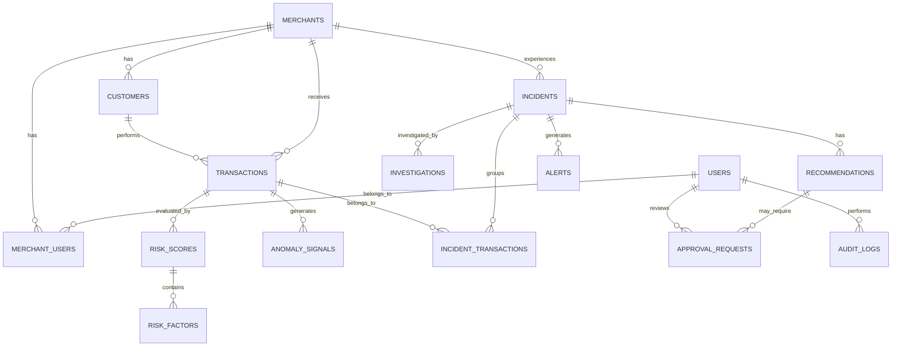

# PayGuard AI — Database Schema

## 1. Document Purpose

This document defines the relational database structure for **PayGuard AI**.

The database must support:

* Users and authentication
* Merchants
* Customers
* Payment transactions
* Razorpay webhook events
* Risk scores
* Risk factors
* Risk rules
* Anomaly signals
* Incidents
* Incident-to-transaction relationships
* AI investigations
* Recommendations
* Alerts
* Approval requests
* Audit logs
* System metrics

Primary database:

```text
PostgreSQL
```

ORM:

```text
SQLAlchemy
```

Migration system:

```text
Alembic
```

---

# 2. Database Design Principles

The PayGuard AI database must follow these principles.

## 2.1 PostgreSQL Is the Source of Truth

Important transaction and risk information must be stored in PostgreSQL.

AI-generated responses must never replace original transaction facts.

---

## 2.2 Financial Data Must Be Traceable

Important risk and incident decisions should always be linked back to:

* Transaction
* Risk factors
* Rule results
* Evidence
* Incident
* Investigation
* Recommendation

---

## 2.3 Preserve Historical Decisions

If a transaction originally received:

```text
Risk Score: 82
```

and the risk model later changes, the original risk result should remain traceable.

Do not silently rewrite historical risk decisions.

---

## 2.4 Use UTC Internally

All timestamps should be stored in UTC.

Frontend may convert timestamps into the user's local timezone.

---

## 2.5 Avoid Floating-Point Money

Monetary values must not use binary floating-point numbers.

Preferred representation:

```text
BIGINT
```

representing the smallest currency unit.

Example:

```text
₹450.25
```

stored as:

```text
45025 paise
```

This prevents floating-point precision errors.

---

# 3. Naming Conventions

Database tables:

```text
snake_case
plural
```

Examples:

```text
users
transactions
risk_scores
risk_factors
incidents
```

Column names:

```text
snake_case
```

Primary keys:

```text
id
```

Foreign keys:

```text
<entity>_id
```

Examples:

```text
merchant_id
transaction_id
incident_id
```

---

# 4. ID Strategy

Internal entities should use:

```text
UUID
```

Example:

```text
f37919d0-8b9d-4bd3-bd86-f63821ba20fa
```

External provider IDs should be stored separately.

Example:

```text
razorpay_payment_id
razorpay_order_id
razorpay_event_id
```

Never use an external provider ID as the application's database primary key.

---

# 5. Core Entity Relationship Overview



---

# 6. users

Stores PayGuard AI application users.

```text
users
```

Columns:

| Column        | Type         | Required | Description           |
| ------------- | ------------ | -------: | --------------------- |
| id            | UUID         |      Yes | Internal user ID      |
| email         | VARCHAR(255) |      Yes | User email            |
| password_hash | VARCHAR(255) |      Yes | Hashed password       |
| full_name     | VARCHAR(150) |      Yes | Display name          |
| role          | VARCHAR(50)  |      Yes | User role             |
| is_active     | BOOLEAN      |      Yes | Account active state  |
| last_login_at | TIMESTAMPTZ  |       No | Last successful login |
| created_at    | TIMESTAMPTZ  |      Yes | Creation timestamp    |
| updated_at    | TIMESTAMPTZ  |      Yes | Last update timestamp |

Possible roles:

```text
ADMIN
RISK_ANALYST
OPERATIONS_ANALYST
VIEWER
```

Constraints:

```text
email UNIQUE
```

Indexes:

```text
idx_users_email
idx_users_role
```

---

# 7. merchants

Represents merchants being monitored.

```text
merchants
```

Columns:

| Column        | Type         | Required | Description                   |
| ------------- | ------------ | -------: | ----------------------------- |
| id            | UUID         |      Yes | Internal merchant ID          |
| external_id   | VARCHAR(100) |       No | External provider merchant ID |
| name          | VARCHAR(200) |      Yes | Merchant name                 |
| business_type | VARCHAR(100) |       No | Business category             |
| status        | VARCHAR(30)  |      Yes | Merchant status               |
| risk_level    | VARCHAR(20)  |      Yes | Current merchant risk level   |
| risk_score    | INTEGER      |      Yes | Current merchant risk score   |
| currency      | VARCHAR(3)   |      Yes | Default currency              |
| country_code  | VARCHAR(3)   |       No | Country                       |
| metadata      | JSONB        |       No | Flexible merchant metadata    |
| created_at    | TIMESTAMPTZ  |      Yes | Creation timestamp            |
| updated_at    | TIMESTAMPTZ  |      Yes | Update timestamp              |

Status examples:

```text
ACTIVE
MONITORING
RESTRICTED
INACTIVE
```

Indexes:

```text
idx_merchants_external_id
idx_merchants_risk_level
idx_merchants_status
```

---

# 8. merchant_users

Maps users to merchants.

Useful when the application supports multiple merchants or multiple analysts.

```text
merchant_users
```

Columns:

| Column      | Type        | Required |
| ----------- | ----------- | -------: |
| id          | UUID        |      Yes |
| merchant_id | UUID        |      Yes |
| user_id     | UUID        |      Yes |
| role        | VARCHAR(50) |      Yes |
| created_at  | TIMESTAMPTZ |      Yes |

Foreign keys:

```text
merchant_id → merchants.id
user_id → users.id
```

Unique constraint:

```text
merchant_id + user_id
```

---

# 9. customers

Represents customers involved in transactions.

```text
customers
```

Columns:

| Column                     | Type         | Required | Description                 |
| -------------------------- | ------------ | -------: | --------------------------- |
| id                         | UUID         |      Yes | Internal customer ID        |
| merchant_id                | UUID         |      Yes | Merchant relationship       |
| external_customer_id       | VARCHAR(150) |       No | External ID                 |
| email_hash                 | VARCHAR(255) |       No | Hashed or masked identifier |
| phone_hash                 | VARCHAR(255) |       No | Hashed or masked identifier |
| country_code               | VARCHAR(3)   |       No | Customer country            |
| historical_avg_amount      | BIGINT       |       No | Historical average payment  |
| lifetime_transaction_count | INTEGER      |      Yes | Transaction count           |
| failed_transaction_count   | INTEGER      |      Yes | Failed transaction count    |
| current_risk_score         | INTEGER      |      Yes | Current risk                |
| current_risk_level         | VARCHAR(20)  |      Yes | Current classification      |
| first_seen_at              | TIMESTAMPTZ  |      Yes | First observed transaction  |
| last_seen_at               | TIMESTAMPTZ  |      Yes | Last observed transaction   |
| created_at                 | TIMESTAMPTZ  |      Yes | Creation                    |
| updated_at                 | TIMESTAMPTZ  |      Yes | Update                      |

Indexes:

```text
idx_customers_merchant_id
idx_customers_external_customer_id
idx_customers_risk_level
```

Sensitive customer information should be minimized.

---

# 10. transactions

This is one of the most important tables in PayGuard AI.

```text
transactions
```

Columns:

| Column              | Type         | Required | Description                    |
| ------------------- | ------------ | -------: | ------------------------------ |
| id                  | UUID         |      Yes | Internal transaction ID        |
| merchant_id         | UUID         |      Yes | Merchant                       |
| customer_id         | UUID         |       No | Customer                       |
| source              | VARCHAR(30)  |      Yes | Transaction source             |
| external_payment_id | VARCHAR(150) |       No | Razorpay/provider payment ID   |
| external_order_id   | VARCHAR(150) |       No | Provider order ID              |
| amount              | BIGINT       |      Yes | Smallest currency unit         |
| currency            | VARCHAR(3)   |      Yes | Currency code                  |
| payment_method      | VARCHAR(50)  |      Yes | UPI/card/etc                   |
| payment_provider    | VARCHAR(100) |       No | Provider/bank                  |
| bank                | VARCHAR(100) |       No | Bank                           |
| status              | VARCHAR(30)  |      Yes | Payment status                 |
| failure_code        | VARCHAR(100) |       No | Failure code                   |
| failure_reason      | TEXT         |       No | Failure reason                 |
| device_fingerprint  | VARCHAR(255) |       No | Device identifier              |
| ip_hash             | VARCHAR(255) |       No | Hashed IP                      |
| country_code        | VARCHAR(3)   |       No | Transaction country            |
| city                | VARCHAR(100) |       No | Approximate city               |
| latitude            | DECIMAL(9,6) |       No | Optional approximate latitude  |
| longitude           | DECIMAL(9,6) |       No | Optional approximate longitude |
| is_international    | BOOLEAN      |      Yes | International flag             |
| metadata            | JSONB        |       No | Flexible metadata              |
| occurred_at         | TIMESTAMPTZ  |      Yes | Actual payment time            |
| received_at         | TIMESTAMPTZ  |      Yes | PayGuard ingestion time        |
| created_at          | TIMESTAMPTZ  |      Yes | Database creation              |

Source values:

```text
SIMULATOR
RAZORPAY
MANUAL_API
```

Status examples:

```text
CREATED
AUTHORIZED
CAPTURED
FAILED
REFUNDED
PARTIALLY_REFUNDED
```

Indexes:

```text
idx_transactions_merchant_id
idx_transactions_customer_id
idx_transactions_external_payment_id
idx_transactions_status
idx_transactions_payment_method
idx_transactions_bank
idx_transactions_occurred_at
```

Composite indexes:

```text
merchant_id + occurred_at
merchant_id + status + occurred_at
payment_method + status + occurred_at
bank + status + occurred_at
```

---

# 11. webhook_events

Stores incoming provider webhook events.

```text
webhook_events
```

Columns:

| Column            | Type         | Required |
| ----------------- | ------------ | -------: |
| id                | UUID         |      Yes |
| provider          | VARCHAR(50)  |      Yes |
| external_event_id | VARCHAR(200) |       No |
| event_type        | VARCHAR(150) |      Yes |
| payload_hash      | VARCHAR(255) |      Yes |
| payload           | JSONB        |      Yes |
| signature_valid   | BOOLEAN      |      Yes |
| processing_status | VARCHAR(30)  |      Yes |
| error_message     | TEXT         |       No |
| received_at       | TIMESTAMPTZ  |      Yes |
| processed_at      | TIMESTAMPTZ  |       No |
| created_at        | TIMESTAMPTZ  |      Yes |

Processing states:

```text
RECEIVED
PROCESSING
PROCESSED
FAILED
DUPLICATE
```

Unique constraint when available:

```text
provider + external_event_id
```

Fallback duplicate protection:

```text
payload_hash
```

---

# 12. risk_scores

Stores risk evaluations for transactions.

A transaction may have more than one score over time.

```text
risk_scores
```

Columns:

| Column              | Type        | Required |
| ------------------- | ----------- | -------: |
| id                  | UUID        |      Yes |
| transaction_id      | UUID        |      Yes |
| score               | INTEGER     |      Yes |
| risk_level          | VARCHAR(20) |      Yes |
| rule_score          | INTEGER     |      Yes |
| anomaly_score       | INTEGER     |      Yes |
| contextual_score    | INTEGER     |      Yes |
| model_version       | VARCHAR(50) |      Yes |
| calculation_version | VARCHAR(50) |      Yes |
| evaluated_at        | TIMESTAMPTZ |      Yes |
| created_at          | TIMESTAMPTZ |      Yes |

Score range:

```text
0–100
```

Risk levels:

```text
LOW
MEDIUM
HIGH
CRITICAL
```

Constraint:

```text
score >= 0 AND score <= 100
```

Indexes:

```text
idx_risk_scores_transaction_id
idx_risk_scores_risk_level
idx_risk_scores_evaluated_at
```

---

# 13. risk_factors

Stores explainable reasons behind each risk score.

```text
risk_factors
```

Columns:

| Column             | Type         | Required |
| ------------------ | ------------ | -------: |
| id                 | UUID         |      Yes |
| risk_score_id      | UUID         |      Yes |
| transaction_id     | UUID         |      Yes |
| factor_code        | VARCHAR(100) |      Yes |
| factor_name        | VARCHAR(150) |      Yes |
| factor_type        | VARCHAR(50)  |      Yes |
| score_contribution | INTEGER      |      Yes |
| reason             | TEXT         |      Yes |
| evidence           | JSONB        |       No |
| created_at         | TIMESTAMPTZ  |      Yes |

Factor types:

```text
RULE
ANOMALY
HISTORICAL
CONTEXTUAL
```

Example:

```text
factor_code:
HIGH_VELOCITY

score_contribution:
25

reason:
Customer attempted 7 payments within 60 seconds.
```

---

# 14. risk_rules

Stores configurable deterministic risk rules.

```text
risk_rules
```

Columns:

| Column        | Type         | Required |
| ------------- | ------------ | -------: |
| id            | UUID         |      Yes |
| code          | VARCHAR(100) |      Yes |
| name          | VARCHAR(150) |      Yes |
| description   | TEXT         |      Yes |
| category      | VARCHAR(50)  |      Yes |
| score         | INTEGER      |      Yes |
| severity      | VARCHAR(20)  |      Yes |
| configuration | JSONB        |      Yes |
| is_enabled    | BOOLEAN      |      Yes |
| version       | INTEGER      |      Yes |
| created_at    | TIMESTAMPTZ  |      Yes |
| updated_at    | TIMESTAMPTZ  |      Yes |

Examples:

```text
HIGH_AMOUNT
HIGH_VELOCITY
NEW_DEVICE
GEO_MISMATCH
REPEATED_FAILURES
RISKY_BANK_PATTERN
```

Unique:

```text
code + version
```

---

# 15. rule_executions

Records which rules were evaluated.

```text
rule_executions
```

Columns:

| Column             | Type        | Required |
| ------------------ | ----------- | -------: |
| id                 | UUID        |      Yes |
| transaction_id     | UUID        |      Yes |
| risk_rule_id       | UUID        |      Yes |
| matched            | BOOLEAN     |      Yes |
| score_contribution | INTEGER     |      Yes |
| evidence           | JSONB       |       No |
| executed_at        | TIMESTAMPTZ |      Yes |

This provides traceability for risk scoring.

---

# 16. anomaly_signals

Stores statistical anomaly results.

```text
anomaly_signals
```

Columns:

| Column         | Type         | Required |
| -------------- | ------------ | -------: |
| id             | UUID         |      Yes |
| transaction_id | UUID         |       No |
| merchant_id    | UUID         |       No |
| signal_type    | VARCHAR(100) |      Yes |
| metric_name    | VARCHAR(100) |      Yes |
| observed_value | DECIMAL      |      Yes |
| baseline_value | DECIMAL      |       No |
| deviation      | DECIMAL      |       No |
| anomaly_score  | INTEGER      |      Yes |
| severity       | VARCHAR(20)  |      Yes |
| evidence       | JSONB        |       No |
| detected_at    | TIMESTAMPTZ  |      Yes |

Examples:

```text
PAYMENT_FAILURE_SPIKE
TRANSACTION_VELOCITY
AMOUNT_OUTLIER
BANK_DEGRADATION
REFUND_SPIKE
```

---

# 17. incidents

Represents a grouped risk event.

```text
incidents
```

Columns:

| Column                     | Type         | Required |
| -------------------------- | ------------ | -------: |
| id                         | UUID         |      Yes |
| merchant_id                | UUID         |       No |
| incident_number            | VARCHAR(50)  |      Yes |
| title                      | VARCHAR(255) |      Yes |
| description                | TEXT         |       No |
| incident_type              | VARCHAR(100) |      Yes |
| severity                   | VARCHAR(20)  |      Yes |
| status                     | VARCHAR(30)  |      Yes |
| risk_score                 | INTEGER      |      Yes |
| confidence_score           | DECIMAL(5,4) |       No |
| affected_transaction_count | INTEGER      |      Yes |
| affected_payment_value     | BIGINT       |      Yes |
| revenue_at_risk            | BIGINT       |      Yes |
| primary_payment_method     | VARCHAR(50)  |       No |
| primary_bank               | VARCHAR(100) |       No |
| correlation_key            | VARCHAR(255) |       No |
| started_at                 | TIMESTAMPTZ  |      Yes |
| detected_at                | TIMESTAMPTZ  |      Yes |
| resolved_at                | TIMESTAMPTZ  |       No |
| created_at                 | TIMESTAMPTZ  |      Yes |
| updated_at                 | TIMESTAMPTZ  |      Yes |

Example incident number:

```text
PG-2026-000001
```

Incident types:

```text
PAYMENT_FAILURE_SPIKE
FRAUD_PATTERN
VELOCITY_ATTACK
BANK_DEGRADATION
MERCHANT_ANOMALY
REFUND_SPIKE
CHARGEBACK_SPIKE
ACCOUNT_TAKEOVER_PATTERN
```

Statuses:

```text
DETECTED
INVESTIGATING
ACTION_RECOMMENDED
MONITORING
RESOLVED
ESCALATED
```

Indexes:

```text
idx_incidents_status
idx_incidents_severity
idx_incidents_detected_at
idx_incidents_merchant_id
idx_incidents_incident_number
```

---

# 18. incident_transactions

Many-to-many relationship between incidents and transactions.

```text
incident_transactions
```

Columns:

| Column            | Type        | Required |
| ----------------- | ----------- | -------: |
| id                | UUID        |      Yes |
| incident_id       | UUID        |      Yes |
| transaction_id    | UUID        |      Yes |
| relationship_type | VARCHAR(50) |      Yes |
| relevance_score   | INTEGER     |       No |
| added_at          | TIMESTAMPTZ |      Yes |

Relationship types:

```text
PRIMARY
RELATED
SUPPORTING_EVIDENCE
```

Unique:

```text
incident_id + transaction_id
```

---

# 19. incident_events

Stores the timeline of an incident.

```text
incident_events
```

Columns:

| Column      | Type         | Required |
| ----------- | ------------ | -------: |
| id          | UUID         |      Yes |
| incident_id | UUID         |      Yes |
| event_type  | VARCHAR(100) |      Yes |
| title       | VARCHAR(255) |      Yes |
| description | TEXT         |       No |
| actor_type  | VARCHAR(30)  |      Yes |
| actor_id    | UUID         |       No |
| metadata    | JSONB        |       No |
| occurred_at | TIMESTAMPTZ  |      Yes |

Example timeline:

```text
14:32
Anomaly detected

14:33
Incident created

14:34
Risk score increased to 87

14:35
AI investigation started

14:36
Likely bank degradation identified

14:37
Mitigation recommendation generated
```

Actor types:

```text
SYSTEM
AI
USER
WEBHOOK
```

---

# 20. investigations

Stores AI or system-generated incident investigations.

```text
investigations
```

Columns:

| Column             | Type         | Required |
| ------------------ | ------------ | -------: |
| id                 | UUID         |      Yes |
| incident_id        | UUID         |      Yes |
| status             | VARCHAR(30)  |      Yes |
| investigation_type | VARCHAR(50)  |      Yes |
| summary            | TEXT         |       No |
| likely_root_cause  | TEXT         |       No |
| confidence_score   | DECIMAL(5,4) |       No |
| evidence           | JSONB        |       No |
| uncertainties      | JSONB        |       No |
| model_provider     | VARCHAR(50)  |       No |
| model_name         | VARCHAR(100) |       No |
| prompt_version     | VARCHAR(50)  |       No |
| started_at         | TIMESTAMPTZ  |      Yes |
| completed_at       | TIMESTAMPTZ  |       No |
| created_at         | TIMESTAMPTZ  |      Yes |

Statuses:

```text
PENDING
RUNNING
COMPLETED
FAILED
```

The original structured evidence should be preserved.

---

# 21. recommendations

Stores mitigation recommendations.

```text
recommendations
```

Columns:

| Column              | Type         | Required |
| ------------------- | ------------ | -------: |
| id                  | UUID         |      Yes |
| incident_id         | UUID         |      Yes |
| investigation_id    | UUID         |       No |
| recommendation_type | VARCHAR(100) |      Yes |
| title               | VARCHAR(255) |      Yes |
| description         | TEXT         |      Yes |
| reasoning           | TEXT         |      Yes |
| expected_impact     | TEXT         |       No |
| risk_if_ignored     | TEXT         |       No |
| requires_approval   | BOOLEAN      |      Yes |
| priority            | VARCHAR(20)  |      Yes |
| status              | VARCHAR(30)  |      Yes |
| created_at          | TIMESTAMPTZ  |      Yes |
| updated_at          | TIMESTAMPTZ  |      Yes |

Statuses:

```text
GENERATED
PENDING_APPROVAL
APPROVED
REJECTED
EXECUTED
DISMISSED
```

---

# 22. approval_requests

Stores explicit human approval for sensitive actions.

```text
approval_requests
```

Columns:

| Column            | Type         | Required |
| ----------------- | ------------ | -------: |
| id                | UUID         |      Yes |
| recommendation_id | UUID         |      Yes |
| incident_id       | UUID         |      Yes |
| action_type       | VARCHAR(100) |      Yes |
| requested_by_type | VARCHAR(30)  |      Yes |
| requested_by_id   | UUID         |       No |
| status            | VARCHAR(30)  |      Yes |
| reviewed_by       | UUID         |       No |
| review_reason     | TEXT         |       No |
| requested_at      | TIMESTAMPTZ  |      Yes |
| reviewed_at       | TIMESTAMPTZ  |       No |
| expires_at        | TIMESTAMPTZ  |       No |

Statuses:

```text
PENDING
APPROVED
REJECTED
EXPIRED
CANCELLED
```

---

# 23. mitigation_actions

Records actual mitigation executions.

```text
mitigation_actions
```

Columns:

| Column              | Type         | Required |
| ------------------- | ------------ | -------: |
| id                  | UUID         |      Yes |
| incident_id         | UUID         |      Yes |
| recommendation_id   | UUID         |       No |
| approval_request_id | UUID         |       No |
| action_type         | VARCHAR(100) |      Yes |
| execution_mode      | VARCHAR(30)  |      Yes |
| status              | VARCHAR(30)  |      Yes |
| request_payload     | JSONB        |       No |
| response_payload    | JSONB        |       No |
| error_message       | TEXT         |       No |
| executed_by         | UUID         |       No |
| started_at          | TIMESTAMPTZ  |      Yes |
| completed_at        | TIMESTAMPTZ  |       No |

Execution mode:

```text
AUTOMATIC_SAFE
HUMAN_APPROVED
SIMULATED
```

For the hackathon, high-impact actions can safely operate in:

```text
SIMULATED
```

mode.

---

# 24. alerts

Stores alerts generated by risk or incident systems.

```text
alerts
```

Columns:

| Column          | Type         | Required |
| --------------- | ------------ | -------: |
| id              | UUID         |      Yes |
| merchant_id     | UUID         |       No |
| incident_id     | UUID         |       No |
| transaction_id  | UUID         |       No |
| alert_type      | VARCHAR(100) |      Yes |
| severity        | VARCHAR(20)  |      Yes |
| title           | VARCHAR(255) |      Yes |
| message         | TEXT         |      Yes |
| status          | VARCHAR(30)  |      Yes |
| source          | VARCHAR(50)  |      Yes |
| created_at      | TIMESTAMPTZ  |      Yes |
| acknowledged_at | TIMESTAMPTZ  |       No |
| acknowledged_by | UUID         |       No |

Statuses:

```text
OPEN
ACKNOWLEDGED
RESOLVED
DISMISSED
```

---

# 25. merchant_metrics

Stores aggregated merchant-level metrics.

```text
merchant_metrics
```

Columns:

| Column                     | Type         | Required |
| -------------------------- | ------------ | -------: |
| id                         | UUID         |      Yes |
| merchant_id                | UUID         |      Yes |
| metric_window              | VARCHAR(30)  |      Yes |
| total_transactions         | INTEGER      |      Yes |
| successful_transactions    | INTEGER      |      Yes |
| failed_transactions        | INTEGER      |      Yes |
| failure_rate               | DECIMAL(8,5) |      Yes |
| total_payment_value        | BIGINT       |      Yes |
| average_transaction_value  | BIGINT       |      Yes |
| high_risk_transactions     | INTEGER      |      Yes |
| critical_risk_transactions | INTEGER      |      Yes |
| open_incidents             | INTEGER      |      Yes |
| revenue_at_risk            | BIGINT       |      Yes |
| calculated_at              | TIMESTAMPTZ  |      Yes |

Possible windows:

```text
1_MIN
5_MIN
15_MIN
1_HOUR
24_HOUR
7_DAY
```

---

# 26. provider_metrics

Tracks health by bank/provider/payment method.

```text
provider_metrics
```

Columns:

| Column             | Type         | Required |
| ------------------ | ------------ | -------: |
| id                 | UUID         |      Yes |
| provider_name      | VARCHAR(100) |      Yes |
| payment_method     | VARCHAR(50)  |      Yes |
| metric_window      | VARCHAR(30)  |      Yes |
| transaction_count  | INTEGER      |      Yes |
| success_count      | INTEGER      |      Yes |
| failure_count      | INTEGER      |      Yes |
| success_rate       | DECIMAL(8,5) |      Yes |
| failure_rate       | DECIMAL(8,5) |      Yes |
| average_latency_ms | INTEGER      |       No |
| anomaly_score      | INTEGER      |      Yes |
| calculated_at      | TIMESTAMPTZ  |      Yes |

This table helps detect:

```text
Bank-specific degradation
Payment-method degradation
Provider outages
```

---

# 27. copilot_conversations

Stores AI Copilot sessions.

```text
copilot_conversations
```

Columns:

| Column      | Type         | Required |
| ----------- | ------------ | -------: |
| id          | UUID         |      Yes |
| user_id     | UUID         |      Yes |
| merchant_id | UUID         |       No |
| title       | VARCHAR(255) |       No |
| created_at  | TIMESTAMPTZ  |      Yes |
| updated_at  | TIMESTAMPTZ  |      Yes |

---

# 28. copilot_messages

Stores individual Copilot messages.

```text
copilot_messages
```

Columns:

| Column              | Type         | Required |
| ------------------- | ------------ | -------: |
| id                  | UUID         |      Yes |
| conversation_id     | UUID         |      Yes |
| role                | VARCHAR(30)  |      Yes |
| content             | TEXT         |      Yes |
| context_snapshot    | JSONB        |       No |
| referenced_entities | JSONB        |       No |
| model_name          | VARCHAR(100) |       No |
| created_at          | TIMESTAMPTZ  |      Yes |

Roles:

```text
USER
ASSISTANT
SYSTEM
```

---

# 29. audit_logs

Stores immutable-style audit events.

```text
audit_logs
```

Columns:

| Column      | Type         | Required |
| ----------- | ------------ | -------: |
| id          | UUID         |      Yes |
| user_id     | UUID         |       No |
| actor_type  | VARCHAR(30)  |      Yes |
| actor_id    | VARCHAR(150) |       No |
| action      | VARCHAR(150) |      Yes |
| entity_type | VARCHAR(100) |      Yes |
| entity_id   | UUID         |       No |
| request_id  | VARCHAR(100) |       No |
| ip_hash     | VARCHAR(255) |       No |
| metadata    | JSONB        |       No |
| created_at  | TIMESTAMPTZ  |      Yes |

Examples:

```text
USER_LOGIN
TRANSACTION_INGESTED
RISK_SCORE_CREATED
INCIDENT_CREATED
INVESTIGATION_COMPLETED
RECOMMENDATION_CREATED
APPROVAL_GRANTED
MITIGATION_EXECUTED
```

Audit logs should not normally be updated or deleted.

---

# 30. system_events

Stores significant internal system events.

```text
system_events
```

Columns:

| Column     | Type         | Required |
| ---------- | ------------ | -------: |
| id         | UUID         |      Yes |
| event_type | VARCHAR(100) |      Yes |
| severity   | VARCHAR(20)  |      Yes |
| module     | VARCHAR(100) |      Yes |
| message    | TEXT         |      Yes |
| metadata   | JSONB        |       No |
| created_at | TIMESTAMPTZ  |      Yes |

Used for:

```text
AI provider outage
Risk pipeline failure
Webhook processing failure
Database errors
Background task failures
```

---

# 31. Key Foreign Key Relationships

```text
merchant_users.merchant_id
    → merchants.id

merchant_users.user_id
    → users.id

customers.merchant_id
    → merchants.id

transactions.merchant_id
    → merchants.id

transactions.customer_id
    → customers.id

risk_scores.transaction_id
    → transactions.id

risk_factors.risk_score_id
    → risk_scores.id

risk_factors.transaction_id
    → transactions.id

rule_executions.transaction_id
    → transactions.id

rule_executions.risk_rule_id
    → risk_rules.id

incident_transactions.incident_id
    → incidents.id

incident_transactions.transaction_id
    → transactions.id

investigations.incident_id
    → incidents.id

recommendations.incident_id
    → incidents.id

recommendations.investigation_id
    → investigations.id

approval_requests.recommendation_id
    → recommendations.id

approval_requests.incident_id
    → incidents.id

mitigation_actions.incident_id
    → incidents.id

alerts.incident_id
    → incidents.id

alerts.transaction_id
    → transactions.id

audit_logs.user_id
    → users.id
```

---

# 32. Delete Behavior

Financial and risk records should generally not be physically deleted.

Preferred approach:

```text
Soft deletion
or
status-based deactivation
```

For example:

```text
users.is_active = false
```

instead of deleting a user.

Transactions, incidents, investigations, audit logs, and risk evaluations should normally be retained.

---

# 33. Data Classification

## Highly Sensitive

```text
Authentication credentials
API secrets
Provider secrets
Access tokens
```

These should never be stored in normal application tables.

Use:

```text
Environment variables
Secret management
```

---

## Sensitive

```text
Customer identifiers
Device identifiers
IP information
Location information
Payment metadata
```

Store only what is necessary.

Prefer:

```text
Hashing
Masking
Tokenization
```

where possible.

---

## Operational

```text
Risk score
Incident status
Failure rate
Anomaly score
Alerts
Recommendations
```

---

# 34. Example Transaction Record

```json
{
  "id": "ccfc286a-2358-492f-b812-359378d2fa78",
  "merchant_id": "f71988bc-8bd0-49f1-ab3f-771309ee80a1",
  "customer_id": "604ea9ec-18ff-448d-8231-c4bfd60842c1",
  "source": "SIMULATOR",
  "external_payment_id": "pay_demo_001",
  "amount": 5000000,
  "currency": "INR",
  "payment_method": "upi",
  "bank": "ABC Bank",
  "status": "FAILED",
  "failure_code": "PAYMENT_FAILED",
  "occurred_at": "2026-08-24T10:30:00Z"
}
```

Amount:

```text
5000000 paise = ₹50,000
```

---

# 35. Example Risk Result

```json
{
  "transaction_id": "ccfc286a-2358-492f-b812-359378d2fa78",
  "score": 86,
  "risk_level": "CRITICAL",
  "rule_score": 63,
  "anomaly_score": 15,
  "contextual_score": 8,
  "model_version": "risk-v1"
}
```

Related factors:

```json
[
  {
    "factor_code": "HIGH_VELOCITY",
    "score_contribution": 25,
    "reason": "7 payment attempts occurred within 60 seconds."
  },
  {
    "factor_code": "HIGH_AMOUNT",
    "score_contribution": 20,
    "reason": "Transaction amount is 11.9x above historical average."
  },
  {
    "factor_code": "NEW_DEVICE",
    "score_contribution": 18,
    "reason": "Device has not previously been associated with this customer."
  }
]
```

---

# 36. Example Incident

```json
{
  "incident_number": "PG-2026-000042",
  "title": "UPI failure spike associated with ABC Bank",
  "incident_type": "BANK_DEGRADATION",
  "severity": "CRITICAL",
  "status": "INVESTIGATING",
  "risk_score": 91,
  "affected_transaction_count": 342,
  "affected_payment_value": 51000000,
  "revenue_at_risk": 42800000,
  "primary_payment_method": "upi",
  "primary_bank": "ABC Bank"
}
```

---

# 37. MVP Tables

We do not need to build every table on the first day.

The initial MVP migration should prioritize:

```text
users
merchants
customers
transactions
webhook_events
risk_scores
risk_factors
risk_rules
rule_executions
anomaly_signals
incidents
incident_transactions
incident_events
investigations
recommendations
alerts
approval_requests
mitigation_actions
audit_logs
```

Additional analytics tables can be introduced after the core pipeline works.

---

# 38. Database Migration Strategy

Alembic will manage schema versions.

Example progression:

```text
001_create_users_merchants

002_create_customers_transactions

003_create_webhook_events

004_create_risk_engine_tables

005_create_incident_tables

006_create_ai_investigation_tables

007_create_alerts_recommendations

008_create_approval_and_mitigation

009_create_audit_logs

010_add_metrics_tables
```

Never manually modify production schema without a migration.

---

# 39. Transaction Integrity

Critical multi-table operations should use database transactions.

Example:

```text
Create Risk Score
        ↓
Create Risk Factors
        ↓
Create Rule Executions
```

These should succeed together when logically part of the same operation.

If an error occurs:

```text
ROLLBACK
```

This prevents partially written financial-risk state.

---

# 40. Idempotency Requirements

The schema should protect against duplicates.

Important unique values:

```text
external_payment_id
provider + external_event_id
incident_id + transaction_id
merchant_id + user_id
```

Duplicate webhook delivery must not generate duplicate payments.

---

# 41. Performance Indexing

High-frequency queries will typically filter using:

```text
merchant_id
customer_id
status
risk_level
occurred_at
payment_method
bank
incident status
incident severity
```

Indexes should be added based on actual application query patterns.

Avoid excessive indexing before measuring performance.

---

# 42. Dashboard Queries

The database must efficiently support dashboard calculations such as:

```text
Transactions processed today
Success rate
Failure rate
Critical transactions
Open incidents
Critical incidents
Revenue at risk
Payment-method performance
Bank performance
Risk distribution
Recent alerts
```

Aggregated metrics may later be cached or materialized if necessary.

---

# 43. AI Data Boundary

AI must receive only relevant structured data.

Example context:

```json
{
  "incident": {},
  "metrics": {},
  "related_transactions": [],
  "risk_factors": [],
  "historical_baseline": {}
}
```

AI should not receive unrestricted database access.

The backend decides which information enters the AI context.

---

# 44. Schema Evolution Rules

Future schema changes must:

1. Use Alembic migrations.
2. Preserve important historical data.
3. Maintain backwards compatibility where possible.
4. Avoid destructive changes without backups.
5. Update this document when the architecture changes.

---

# 45. Database Success Criteria

The schema is successful when PayGuard AI can reliably trace:

```text
PAYMENT
   ↓
TRANSACTION RECORD
   ↓
RISK EVALUATION
   ↓
RISK FACTORS
   ↓
ANOMALY SIGNALS
   ↓
INCIDENT
   ↓
INVESTIGATION
   ↓
RECOMMENDATION
   ↓
APPROVAL
   ↓
MITIGATION
   ↓
AUDIT LOG
```

Every important decision should remain explainable and traceable from the final incident back to the original payment evidence.
